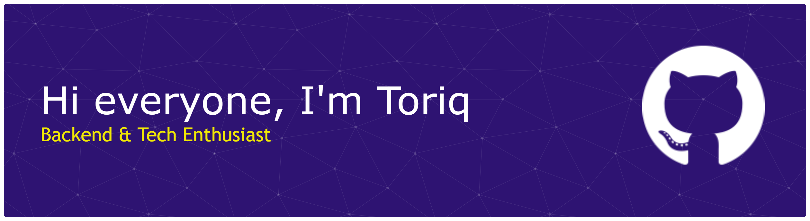

## 🚀 **My Programing Languanges**
 

## 🧑🏻‍💻 **Frameworks**
 

## 📨 **Let's Connect**
  

<picture>
  <source media="(prefers-color-scheme: dark)" srcset="https://raw.githubusercontent.com/MuhamadToriquddin/MuhamadToriquddin/output/pacman-contribution-graph-dark.svg">
  <source media="(prefers-color-scheme: light)" srcset="https://raw.githubusercontent.com/MuhamadToriquddin/MuhamadToriquddin/output/pacman-contribution-graph.svg">
  
</picture>